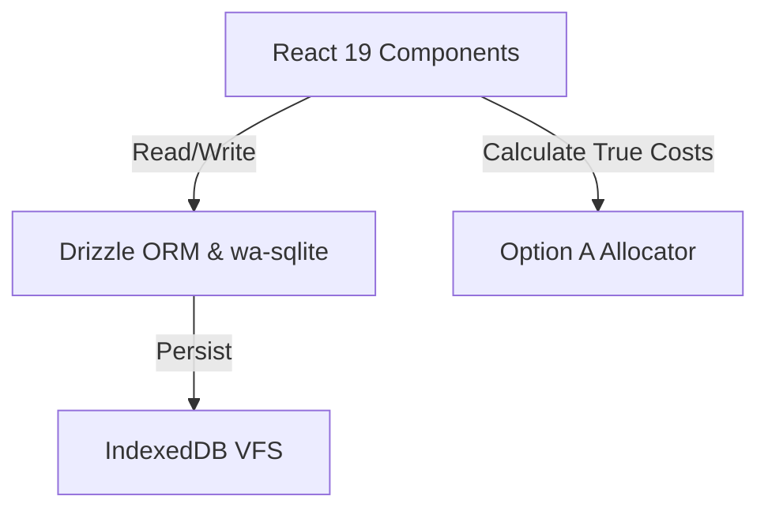

# Spec 01: Project Setup & Database

## Goal
Set up the client-side React 19 + Vite + Tailwind CSS v4 development environment, configure the local SQLite database layer using `wa-sqlite`, IndexedDB, and Drizzle ORM, and implement the Option A shipping cost allocation math engine.

## Design
The project structure will be clean and modular, maintaining strict separation of concerns between visual elements, queries, and mathematical formulas:
- **Database Module**: Isolated within `src/db/` to define tables, relationships, and the SQLite connection instance.
- **Math Engine**: Contained within `src/lib/math/` for pure, unit-testable calculations.
- **Environment**: Client-side single-page application (SPA) running entirely in the browser with no external network server dependencies.



## Implementation

### 1. Database Schema (`src/db/schema.ts`)
We define three relational tables in SQLite using Drizzle ORM:

```typescript
import { sqliteTable, integer, text } from 'drizzle-orm/sqlite-core';

// 1. Transactions Table
export const transactions = sqliteTable('transactions', {
  id: integer('id').primaryKey({ autoIncrement: true }),
  amount: integer('amount').notNull(), // Scaled integer (Taka * 100) to represent Poisha
  category: text('category', {
    enum: [
      'personal_expense', 
      'tailoring_expense', 
      'clothing_overhead', 
      'tailoring_income', 
      'clothing_income'
    ]
  }).notNull(),
  description: text('description').notNull(),
  createdAt: integer('created_at', { mode: 'timestamp' }).notNull()
});

// 2. Shipments Table
export const shipments = sqliteTable('shipments', {
  id: integer('id').primaryKey({ autoIncrement: true }),
  courierFee: integer('courier_fee').notNull(), // Scaled integer (Taka * 100)
  deliveryDate: integer('delivery_date', { mode: 'timestamp' }).notNull()
});

// 3. Inventory Items Table
export const inventoryItems = sqliteTable('inventory_items', {
  id: integer('id').primaryKey({ autoIncrement: true }),
  shipmentId: integer('shipment_id').references(() => shipments.id, { onDelete: 'cascade' }),
  brand: text('brand').notNull(),
  quantity: integer('quantity').notNull(), // Remaining stock count (must be >= 0)
  wholesaleCost: integer('wholesale_cost').notNull(), // Scaled integer (Taka * 100)
  trueCost: integer('true_cost').notNull() // Calculated: wholesaleCost + proportional courier fee (Scaled integer)
});
```

### 2. SQLite & IndexedDB Setup (`src/db/client.ts`)
- Initialize `wa-sqlite` with an IndexedDB virtual file system (VFS) to persist database state across user browser sessions.
- Expose the Drizzle ORM db client instance.
- Run automated schema migrations or initialization on app mount.

### 3. Option A Cost Allocation Engine (`src/lib/math/allocator.ts`)
Proportional shipping allocation divides the flat shipping fee by the total unit count and increments each item's baseline wholesale cost.
- **Scaled Integer Rule**: All values passed to the calculator are integers scaled by 100.
- **Formula**:
  $$\text{Total Units} = \sum Q_i$$
  $$\text{Proportional Courier Fee Per Unit} = \text{round}\left(\frac{\text{Courier Fee}}{\text{Total Units}}\right)$$
  $$\text{True Cost}_i = \text{Wholesale Cost}_i + \text{Proportional Courier Fee Per Unit}$$
- **Fail-Safe**: If `Total Units` is zero, throw a clear division-by-zero validation error.

```typescript
export interface InputItem {
  quantity: number;
  wholesaleCost: number; // Scaled by 100
}

export function calculateOptionA(courierFee: number, items: InputItem[]): number[] {
  if (items.length === 0) return [];
  
  const totalUnits = items.reduce((sum, item) => sum + item.quantity, 0);
  if (totalUnits <= 0) {
    throw new Error('Total units in a shipment must be greater than zero.');
  }

  // Calculate per-unit fee in scaled integer
  const perUnitFee = Math.round(courierFee / totalUnits);

  return items.map(item => item.wholesaleCost + perUnitFee);
}
```

## Dependencies
The following npm packages will be installed:
- `drizzle-orm` (Relational schema builder)
- `drizzle-kit` (Migration manager, devDependency)
- `@vlcn.io/wa-sqlite` (WebAssembly SQLite build)
- `lucide-react` (iOS compliant vector icons)
- `tailwindcss` (Tailwind CSS v4 framework styling)

## Verification Checklist
- [ ] Database client initializes successfully and creates SQLite db file in IndexedDB VFS.
- [ ] Schema tables can be written to and queried using Drizzle ORM.
- [ ] Unit tests for `calculateOptionA` verify:
  - [ ] Returns empty array for empty inputs.
  - [ ] Correct allocation math for single-item and multi-item lists.
  - [ ] Rounding behavior handles division remainder properly.
  - [ ] Throws boundary exception on zero total units.
- [ ] Tailwind CSS v4 compiles with core theme variables mapping to iOS HIG color codes.
