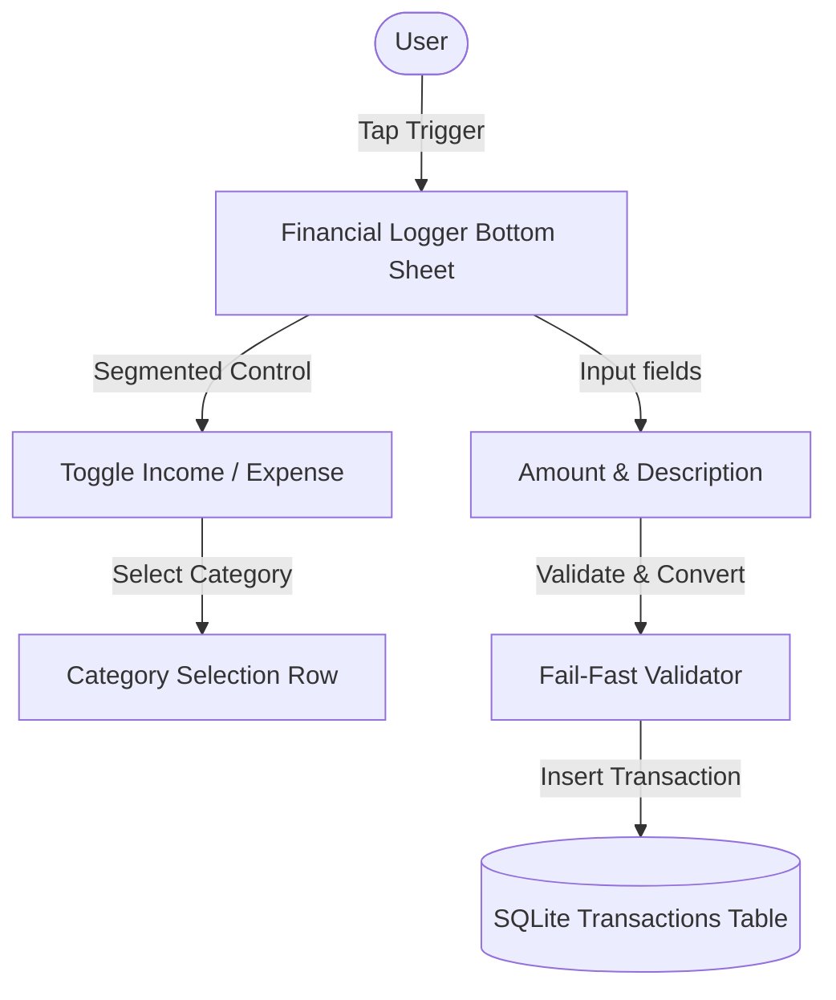

# Spec 02: Dual-Stream Financial Logger

## Goal
Create the Dual-Stream Financial Logger component to record tailoring service income, clothing retail sales, and strictly segregated expenses (Personal vs. Tailoring vs. Clothing Business Overhead) using iOS HIG-compliant form fields and inputs.

## Design
- **View Layout**: Built as a native-feeling iOS Action Sheet (bottom sheet drawer or full-screen modal) with a fixed top navigation containing "Cancel" (left) and "Save" (right) text anchors.
- **Segmented Control**: An iOS-style custom horizontal toggle to switch between **Income** and **Expense** modes, with a sub-selector for specific categories.
- **Target Size**: Minimum 44 x 44 points interactive surface for all buttons, input rows, and form actions.
- **Form Rows**: Clean list-grouped visual structure (`bg-white` card background, `border-slate-200` dividers) matching default iOS system menus.



## Implementation

### 1. UI Components (`src/components/TransactionForm.tsx`)
Create a form wrapper component to log and validate inputs:
- **Amount Input Field**:
  - Raw HTML string text field (numeric keyboard friendly).
  - Uses state: `const [amountStr, setAmountStr] = useState("")`.
  - Parses into scaled integer: `Math.round(parseFloat(amountStr) * 100)`.
- **Category Selector**:
  - Segmented control to select transaction category.
  - **Income Options**: Tailoring Income (`tailoring_income`), Clothing Retail Sale (`clothing_income`).
  - **Expense Options**: Personal Expense (`personal_expense`), Tailoring Business Expense (`tailoring_expense`), Clothing Business Overhead (`clothing_overhead`).
- **Description Input**:
  - Standard text input with floating helper text.
- **Save Trigger**:
  - iOS-style navigation text button "Save" (`text-sky-600 font-semibold active:opacity-60`).

### 2. Validation & Fail-Fast Boundaries
- Confirm amount is a valid positive number. Block zero or negative inputs:
  ```typescript
  const scaledAmount = Math.round(parseFloat(amountStr) * 100);
  if (isNaN(scaledAmount) || scaledAmount <= 0) {
    throw new Error("Transaction amount must be a positive number.");
  }
  ```
- Reject blank descriptions:
  ```typescript
  if (!description.trim()) {
    throw new Error("Transaction description cannot be blank.");
  }
  ```
- Trigger instant UI warning banners or native iOS alert modals when validation fails.

### 3. Database Layer (`src/db/queries/transactions.ts`)
Implement standard queries using the Drizzle DB client:
```typescript
import { db } from '../client';
import { transactions } from '../schema';

export async function insertTransaction(data: {
  amount: number;
  category: 'personal_expense' | 'tailoring_expense' | 'clothing_overhead' | 'tailoring_income' | 'clothing_income';
  description: string;
  createdAt: Date;
}) {
  return await db.insert(transactions).values(data).returning();
}
```

## Dependencies
- Lucide React (for icon selectors)

## Verification Checklist
- [ ] Transaction bottom sheet opens and closes smoothly using local component state toggles.
- [ ] iOS-style Segmented Control switches categories cleanly, modifying the UI options dynamically.
- [ ] Form blocks submission and shows error messages when:
  - [ ] Amount is blank, 0, or negative.
  - [ ] Description is blank.
  - [ ] Category is unselected.
- [ ] Valid inputs are converted into scaled integers (e.g. `150.50` Taka -> `15050` integer) and successfully saved in the SQLite `transactions` table.
- [ ] Tap gestures on rows and buttons display immediate opacity-fading feedback (`active:opacity-60`).
