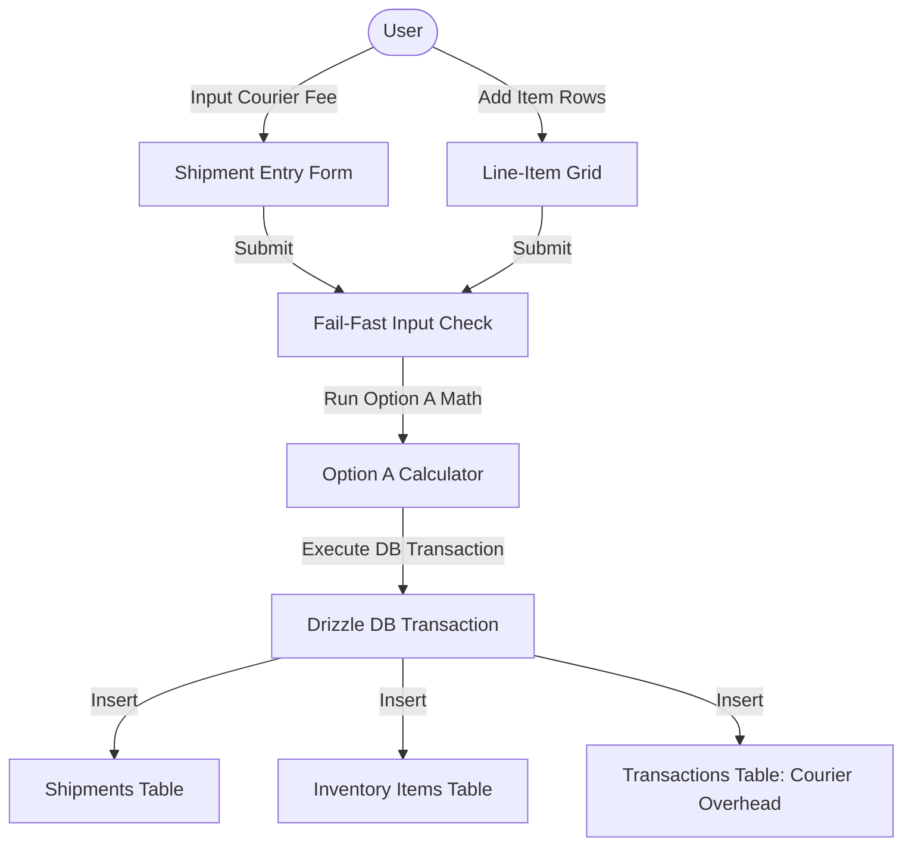

# Spec 03: Itemized Inventory & Shipment Manager

## Goal
Design and implement the Itemized Inventory & Shipment Manager to log multi-brand shipments, compute the true product unit cost using the Option A cost allocation utility, and persist data in a single transactional SQLite execution.

## Design
- **Form Layout**: Tabular inline-form rows with responsive widths. Features floating labels and interactive addition/removal buttons.
- **Visual Feedback**: Real-time display showing the calculated True Cost per item *before* final validation and saving.
- **Stock Grid**: Interactive tables showing current items in stock with remaining unit counts and visual alert badges for low or zero stock.
- **Interactive Targets**: Minimum 44 x 44 points interactive surface area for all list addition, deletion, and submission controls.



## Implementation

### 1. Shipment Intake Form (`src/components/ShipmentForm.tsx`)
Create a dynamic form to manage courier overhead and itemized inventory lines:
- **Courier Fee**: Inputs flat delivery fee (`courierFeeStr`).
- **Dynamic Array Input**: Form stores active lines in local state:
  ```typescript
  interface FormLine {
    brand: string;
    quantityStr: string;
    wholesaleCostStr: string;
  }
  const [lines, setLines] = useState<FormLine[]>([{ brand: '', quantityStr: '', wholesaleCostStr: '' }]);
  ```
- **Live Preview Row**: Compute and display the predicted true cost for each row as the user types:
  - Sum the unit counts.
  - Perform live Option A math, updating the UI dynamically.

### 2. Validation & Fail-Fast Boundaries
- Ensure the Courier Fee is non-negative:
  ```typescript
  const parsedFee = Math.round(parseFloat(courierFeeStr) * 100);
  if (isNaN(parsedFee) || parsedFee < 0) {
    throw new Error("Courier fee must be a valid non-negative number.");
  }
  ```
- Validate every inventory line item:
  - Brand name cannot be empty.
  - Quantity must be an integer greater than 0: `const qty = parseInt(line.quantityStr); if (isNaN(qty) || qty <= 0) ...`
  - Wholesale cost must be positive: `const cost = Math.round(parseFloat(line.wholesaleCostStr) * 100); if (isNaN(cost) || cost <= 0) ...`

### 3. Database Transaction Layer (`src/db/queries/shipments.ts`)
Run database writes inside an explicit Drizzle ORM transaction block. If any insertion fails, the entire transaction is rolled back:
```typescript
import { db } from '../client';
import { shipments, inventoryItems, transactions } from '../schema';

export async function createShipmentTransaction(
  courierFee: number,
  deliveryDate: Date,
  items: { brand: string; quantity: number; wholesaleCost: number; trueCost: number }[]
) {
  return await db.transaction(async (tx) => {
    // 1. Insert Shipment Header
    const [insertedShipment] = await tx.insert(shipments).values({
      courierFee,
      deliveryDate
    }).returning();

    // 2. Insert Batch Inventory Items
    for (const item of items) {
      await tx.insert(inventoryItems).values({
        shipmentId: insertedShipment.id,
        brand: item.brand,
        quantity: item.quantity,
        wholesaleCost: item.wholesaleCost,
        trueCost: item.trueCost
      });
    }

    // 3. Log Courier Fee as Business Overhead Transaction
    if (courierFee > 0) {
      await tx.insert(transactions).values({
        amount: courierFee,
        category: 'clothing_overhead',
        description: `Shipment #${insertedShipment.id} Courier Fee Overhead`,
        createdAt: deliveryDate
      });
    }
    
    return insertedShipment;
  });
}
```

## Dependencies
- None (inherits standard client dependencies)

## Verification Checklist
- [ ] Interface allows dynamically adding and removing brand line rows.
- [ ] Invalid inputs (e.g., negative quantity, blank brand name) trigger error flags and block submission.
- [ ] Database transaction rollback functions: simulated insert failure for a line item does not create orphan shipment or transaction headers.
- [ ] Product True Costs are verified as exact:
  - [ ] Courier Fee: 250.00 Taka (25000), 2 items: Item A (qty 1, wholesale 1000.00), Item B (qty 4, wholesale 1500.00).
  - [ ] Total Units: 5. Per-unit overhead allocation: 50.00 Taka (5000).
  - [ ] Resulting True Costs: Item A true cost = 1050.00 Taka, Item B true cost = 1550.00 Taka.
- [ ] The courier fee is logged in the `transactions` database table as a separate record under the `clothing_overhead` category.
