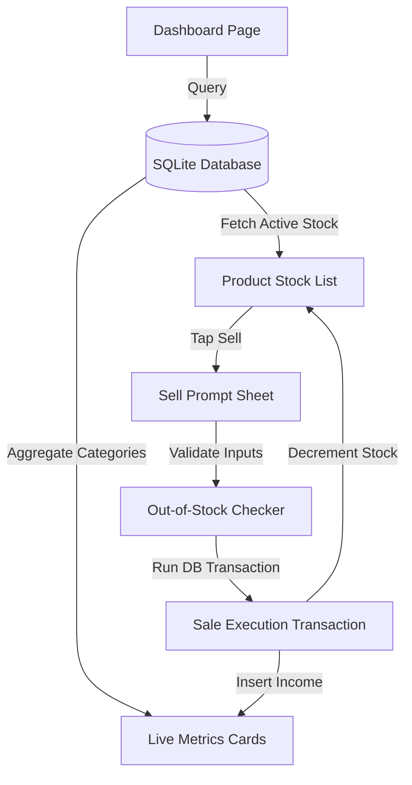

# Spec 04: iOS HIG-Compliant Dashboard

## Goal
Design and implement the primary iOS HIG-compliant Dashboard layout, providing real-time aggregated financial summaries (Tailoring Net, Clothing Net, Total Business Profit, and Safety Pocket ceiling) and supporting interactive inventory sales with automatic stock decrements.

## Design
- **Header**: iOS large navigation bar style showing "ClothEx Dashboard" in `font-sans text-3xl font-bold text-slate-900`.
- **Metrics Grid**: Two-column layout containing rounded-2xl cards with dynamic colored labels (`text-emerald-600` for revenue/profit, `text-red-600` for expenses).
- **Stock Card List**: Scrollable area containing white cards with `border-slate-200` dividers. Each card represents a product batch with a badge displaying the remaining count.
- **Sell Action Trigger**: A clear touch target on each product row (height >= 44 points). Tapping it reveals an iOS-style alert sheet prompting for the final retail sale price in Taka.



## Implementation

### 1. Dynamic Financial Aggregation Queries (`src/db/queries/dashboard.ts`)
Dashboard summary figures must be aggregated dynamically using database queries on each mutation rather than stored as hardcoded columns:
- **Tailoring Net**:
  $$\text{Tailoring Net} = \sum(\text{tailoring\_income}) - \sum(\text{tailoring\_expense})$$
- **Clothing Net**:
  $$\text{Clothing Net} = \sum(\text{clothing\_income}) - \sum(\text{clothing\_overhead})$$
- **Total Business Profit**:
  $$\text{Total Profit} = \text{Tailoring Net} + \text{Clothing Net}$$
- **Safety Pocket**:
  $$\text{Safety Pocket} = \text{Total Profit} - \sum(\text{personal\_expense})$$

Example SQL calculation pattern (run on app load and after mutations):
```typescript
import { db } from '../client';
import { transactions } from '../schema';
import { sum, eq } from 'drizzle-orm';

export async function fetchAggregatedMetrics() {
  const allTx = await db.select().from(transactions);
  
  let tailoringIncome = 0;
  let tailoringExpense = 0;
  let clothingIncome = 0;
  let clothingOverhead = 0;
  let personalExpense = 0;

  for (const t of allTx) {
    if (t.category === 'tailoring_income') tailoringIncome += t.amount;
    if (t.category === 'tailoring_expense') tailoringExpense += t.amount;
    if (t.category === 'clothing_income') clothingIncome += t.amount;
    if (t.category === 'clothing_overhead') clothingOverhead += t.amount;
    if (t.category === 'personal_expense') personalExpense += t.amount;
  }

  const tailoringNet = tailoringIncome - tailoringExpense;
  const clothingNet = clothingIncome - clothingOverhead;
  const totalBusinessProfit = tailoringNet + clothingNet;
  const safetyPocket = totalBusinessProfit - personalExpense;

  return {
    tailoringNet,
    clothingNet,
    totalBusinessProfit,
    safetyPocket
  };
}
```

### 2. Product Sale & Stock Decrement Action (`src/db/queries/inventory.ts`)
Wrap product sales in a database transaction block:
1. Verify the item's quantity is greater than 0. If `quantity === 0`, throw an immediate validation error.
2. Decrement the inventory item's stock count by exactly one unit.
3. Write a new transaction record into the `transactions` table with:
   - Category: `clothing_income`
   - Description: `Sale: ${brand} (True Unit Cost: ${trueCost})`
   - Amount: final retail sale price (scaled integer).

```typescript
export async function executeProductSale(itemId: number, retailPrice: number) {
  return await db.transaction(async (tx) => {
    // 1. Fetch current stock state
    const [item] = await tx.select().from(inventoryItems).where(eq(inventoryItems.id, itemId));
    if (!item) {
      throw new Error("Product item not found.");
    }
    if (item.quantity <= 0) {
      throw new Error("Item is out of stock. Cannot execute sale.");
    }

    // 2. Decrement remaining quantity by 1
    await tx.update(inventoryItems)
      .set({ quantity: item.quantity - 1 })
      .where(eq(inventoryItems.id, itemId));

    // 3. Log sales revenue transaction
    await tx.insert(transactions).values({
      amount: retailPrice,
      category: 'clothing_income',
      description: `Sale: ${item.brand} (Cost: ৳${(item.trueCost / 100).toFixed(2)})`,
      createdAt: new Date()
    });
  });
}
```

## Dependencies
- None (inherits standard client dependencies)

## Verification Checklist
- [ ] Dashboard displays four clear metric cards corresponding to the financial streams.
- [ ] Financial counters update dynamically when a transaction or shipment is successfully submitted.
- [ ] Out-of-Stock Boundaries are enforced:
  - [ ] A product with 0 remaining quantity has its "Sell" action disabled.
  - [ ] Invoking `executeProductSale` manually with an out-of-stock item ID throws an error and rolls back transaction logs.
- [ ] Personal expenses are excluded from Total Business Profit calculations but correctly deducted in the Safety Pocket component.
- [ ] Large navigation headers and metric widgets align perfectly with layout spacing guidelines (paddings, corner-radius system scales).
